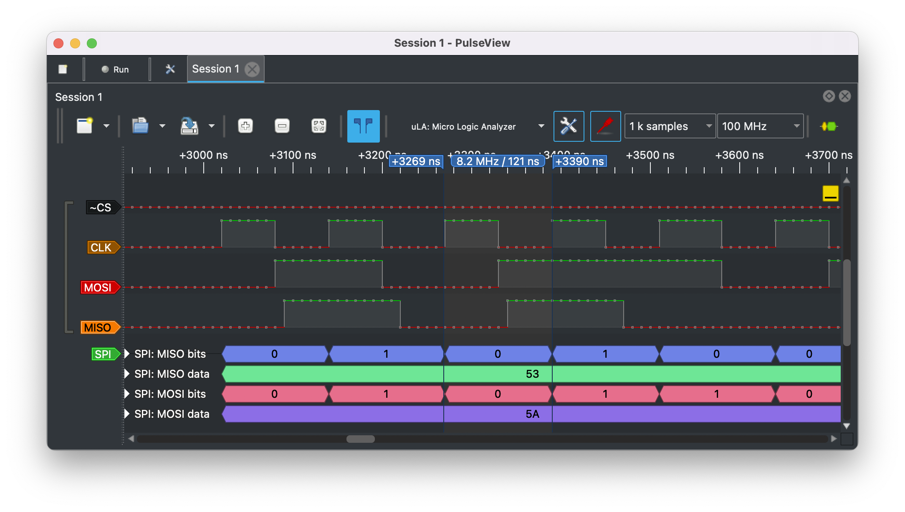
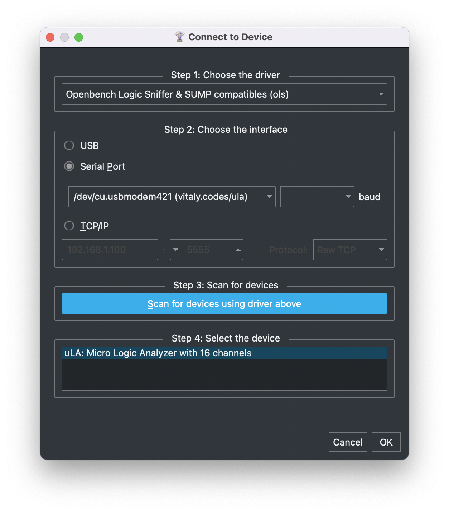

# μLA: Micro Logic Analyzer

SUMP/OLS compatible logic analyzer firmware for [RP2040](https://en.wikipedia.org/wiki/RP2040) based boards.

## Features

* 16 channels
* 100 MHz sampling rate, 1 sample per sys tick
* 200 KB sample memory
* Fast triggers using PIO
* Input channels mapped to GPIO 0-15

## Supported hardware

* [Raspberry Pi Pico](https://www.raspberrypi.com/products/raspberry-pi-pico)
* [uPico](https://github.com/dotcypress/upico)
* Virtually all RP2040 based boards with USB connection and GPIO 0-15 available
* Bring your own RP2040 hardware with proper frontend and protection

## Installation

1. Download latest firmware build from [Releases page](https://github.com/dotcypress/ula/releases)
2. Hold the BOOTSEL button while connecting your board to the computer
3. Copy firmware file downloaded earlier to the RPi-RP2 disk
4. Use PulseView of SigrokCli to connect to probe
5. Enjoy

## Client software

### PulseView



[PulseView](https://sigrok.org/wiki/PulseView) is a Qt based logic analyzer GUI for sigrok.

Select `Openbench Logic Sniffer & SUMP compatible` protocol when connecting to μLA.

Protocol selection         |  Connect window
:-------------------------:|:-------------------------:
 | 

### SigrokCli

[SigrokCli](https://sigrok.org/wiki/Sigrok-cli) is a command-line frontend for sigrok.

Scan for devices
```
$ sigrok-cli -d ols:conn=/dev/tty.usbmodem_ula_1 --scan

  The following devices were found:
  ols - uLA: Micro Logic Analyzer with 16 channels: 0 1 2 3 4 5 6 7 8 9 10 11 12 13 14 15
```

Sample two 10 MHz square waves with 90° phase shift
```
$ sigrok-cli -d ols:conn=/dev/tty.usbmodem_ula_1 
    -O ascii:charset='_`\/'
    --config samplerate=100m
    --samples 70

  libsigrok 0.5.2
  Acquisition with 16/16 channels at 100 MHz
  0:``\____/`````\___/`````\___/`````\___/`````\___/`````\___/`````\___/``
  1:____/`````\____/````\____/````\____/````\____/````\____/````\____/````
  2:______________________________________________________________________
```

## Building firmware

1. Install rustup by following the instructions at https://rustup.rs
2. Install Cortex-M0, M0+, and M1 (ARMv6-M architecture) target: `rustup target add thumbv6m-none-eabi`
3. Install LLVM tools: `rustup component add llvm-tools-preview`
4. Install cargo-binutils: `cargo install cargo-binutils` (Note: on some Linux distros (e.g. Ubuntu) you may need to install the packages build-essential, gcc-arm-none-eabi, libssl-dev and pkg-config prior to installing cargo-binutils)
5. Install elf2uf2: `cargo install elf2uf2-rs`
6. Clone this repo: `git clone git@github.com:dotcypress/ula.git && cd ula`
7. Hold the BOOTSEL button while connecting your board to the computer
8. Flash microcontroller: `cargo run --release`

## License

Licensed under either of

- Apache License, Version 2.0 ([LICENSE-APACHE](LICENSE-APACHE) or
  http://www.apache.org/licenses/LICENSE-2.0)
- MIT license ([LICENSE-MIT](LICENSE-MIT) or http://opensource.org/licenses/MIT)

at your option.

### Contribution

Unless you explicitly state otherwise, any contribution intentionally submitted
for inclusion in the work by you, as defined in the Apache-2.0 license, shall be
dual licensed as above, without any additional terms or conditions.
